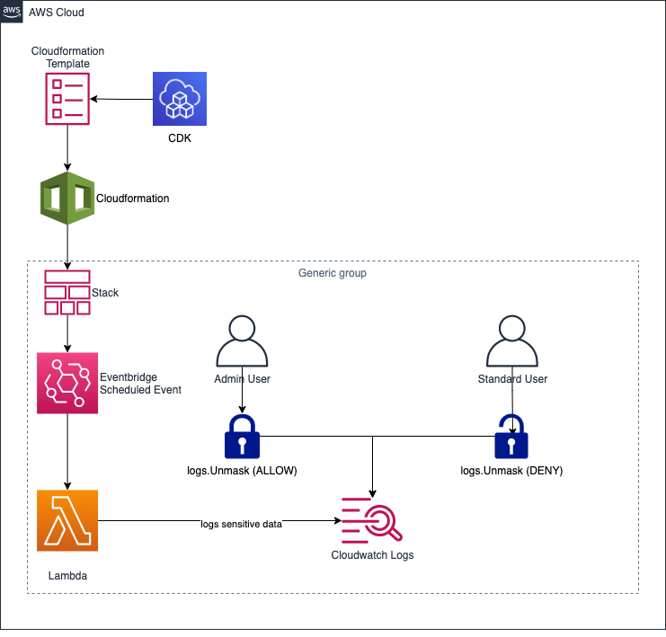
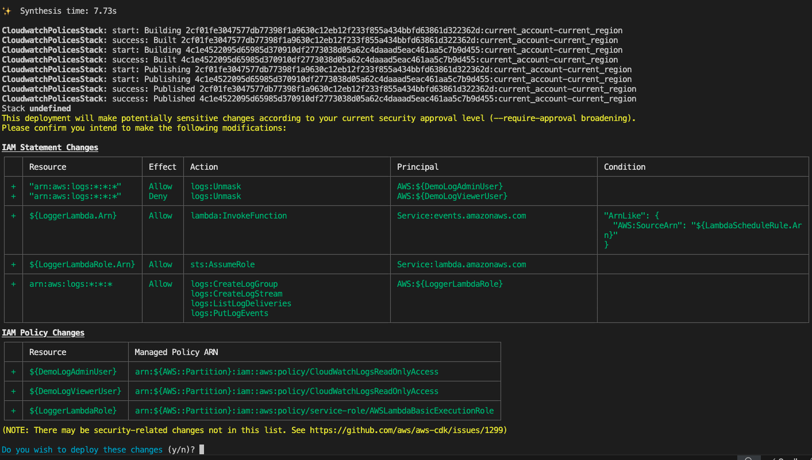
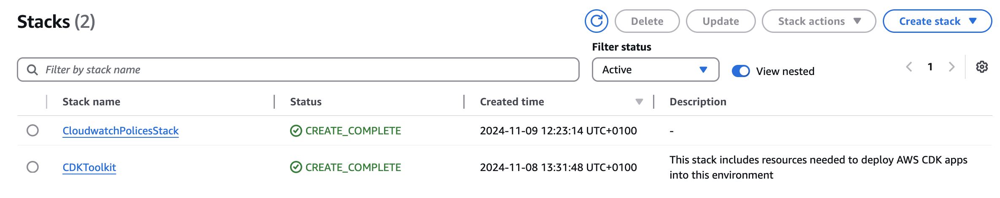
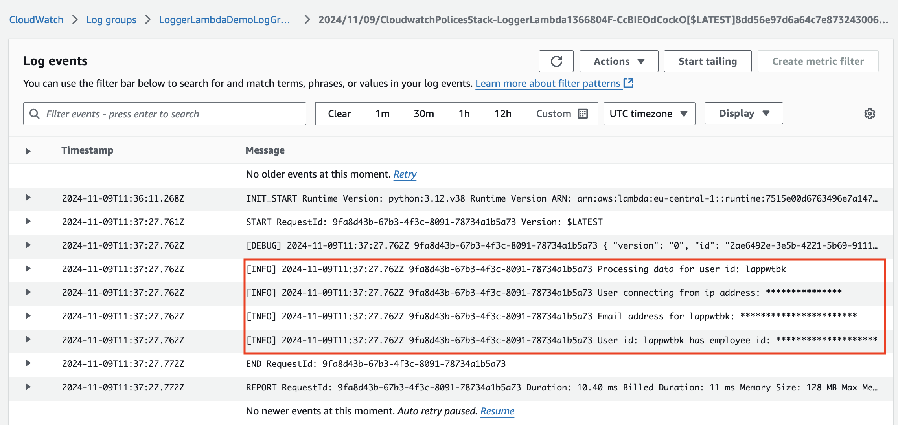
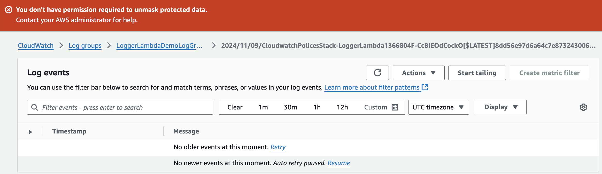
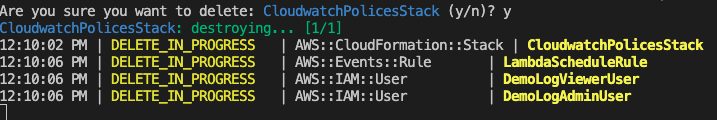

# cloudwatch-logs-data-protection-policies-with-cdk

CDK project that demonstrates the use of [AWS Cloudwatch Logs Data Protection Policies](https://docs.aws.amazon.com/AmazonCloudWatch/latest/logs/cloudwatch-logs-data-protection-policies.html) to mask sensitive data in Cloudwatch Logs.

CloudWatch Logs uses data protection policies to select the sensitive data for which you want to scan, and the actions that you want to take to protect that data. To select the sensitive data of interest, you use [data identifiers](https://docs.aws.amazon.com/AmazonCloudWatch/latest/logs/CWL-managed-data-identifiers.html). CloudWatch Logs data protection then detects the sensitive data by using machine learning and pattern matching. To act upon data identifiers that are found, you can define audit and de-identify operations. These operations let you log the sensitive data that is found (or not found), and to mask the sensitive data when the log events are viewed.

This project defines several data identifiers and a demo AWS Lambda function which logs sensitive data every minute.

2 new user accounts are created;

1. a Privileged User that has the `logs.Unmask` IAM permission allowed and can unmask sensitive log data
2. a Standard User that has the `logs.Unmask` IAM permission denied and can not unmask sensitive log data

----

* [Solution overview](#solution-overview)
* [Key points of the solution](#key-points-of-the-solution)
* [Deploying the solution](#deploying-the-solution)
* [Testing the solution](#testing-the-solution)
  * [Viewing masked sensitive data](#viewing-masked-sensitive-data)
  * [Unmasking sensitive data](#unmasking-sensitive-data)
* [Clean-up the solution](#clean-up-the-solution)
* [Conclusion](#conclusion)
* [Executing unit tests](#executing-unit-tests)

## Solution overview

The solution architecture discussed in this post is presented below:



1. CDK is used to synthesize a CloudFormation template.
2. The Cloudformation template is deployed to create a new Cloudformation Stack containing:
    * AWS Lambda function that logs sensitive data every minute (as defined by an [Amazon EventBridge Scheduler](https://docs.aws.amazon.com/eventbridge/latest/userguide/using-eventbridge-scheduler.html))
    * Amazon Cloudwatch Log Group which is the log destination for the Lambda function. The log group has a data protection policy applied with several data identifiers defined.
    * 2 new user accounts;
        1. a Privileged User that has the `logs.Unmask` IAM permission allowed and can unmask sensitive log data
        2. a Standard User that has the `logs.Unmask` IAM permission denied and can not unmask sensitive log data

## Key points of the solution

The relevant section of the CDK [stacks/cloudwatch_policies.py](stacks/cloudwatch_policies.py) stack, in which the Data Protection Policy is defined, is shown below:

```python
data_protection_policy = logs.DataProtectionPolicy(
    name="LoggerDataProtectionPolicy",
    description="Demo data protection policy for Logger Lambda",
    identifiers=[
        logs.DataIdentifier.EMAILADDRESS,
        logs.DataIdentifier.IPADDRESS,
        logs.CustomDataIdentifier('EmployeeId', 'EmployeeId-\d{9}')
    ]
)

lambda_log_group = logs.LogGroup(
    self,
    "LoggerLambdaLogGroup",
    log_group_name="LoggerLambdaDemoLogGroup",
    data_protection_policy=data_protection_policy
)
```

3 Data Identifiers are defined:

1. EMAILADDRESS: this is default data identifier that checks for logs matching an email addresses pattern in Cloudwatch Logs.
2. IPADDRESS: this is default data identifier that checks for logs matching an ip address pattern in Cloudwatch Logs.
3. CustomDataIdentifier: this is a custom data identifier that checks for a pattern that matches a particular employee id format.


A [demo Lambda function](stacks/resources/logger/logger.py) is created which executes every minute and logs sensitive data.

```python
import json
import logging
import random
import string
from typing import Any

# set logging
logger = logging.getLogger()
logger.setLevel(logging.DEBUG)

def lambda_handler(event, context):
    
    # print the event details
    logger.debug(json.dumps(event, indent=2))

    user_id = generate_random_data(string.ascii_lowercase, 8)
    
    employee_id = generate_random_data(string.digits, length=9)

    # writing log information
    logger.info(f"Processing data for user id: {user_id}")

    # ip address - to be masked
    logger.info(f"User connecting from ip address: {generate_random_ip_address()}")

    # email address - to be masked
    logger.info(f"Email address for {user_id}: {user_id}@fakedomain.com")

    # aws secret key - to be masked
    logger.info(f"User id: {user_id} has employee id: EmployeeId-{employee_id}")


def generate_random_data(string_type: Any, length: int) -> str:

    return ''.join(
        random.choices(
            string_type,
            k=length
        )
    )

def generate_random_ip_address() -> str:

    return ".".join(str(random.randint(0, 255)) for _ in range(4))
```

## Deploying the solution

The solution code uses the Python flavour of the AWS CDK ([Cloud Development Kit](https://aws.amazon.com/cdk/)). In order to execute the solution code, please ensure that you have fulfilled the [AWS CDK Prerequisites for Python](https://docs.aws.amazon.com/cdk/latest/guide/work-with-cdk-python.html).

Additionally, some pre-configuration is required prior to deploying the project in order to assign passwords to the 2 new user accounts that will be created.

The passwords are to be defined in the [cdk.json](cdk.json) file in the section shown below:

```json
"app_properties": {
    "privileged_user_password": "ADD_PASSWORD_HERE",
    "standard_user_password": "ADD_PASSWORD_HERE"
}
```

Please add passwords for both the `privileged_user_password` and the `standard_user_password` that meet the following complexity requirements:

* Password should have at least one lowercase letter
* Password should have at least one number
* Password must 8 characters or greater

The solution code requires that the AWS account is [bootstrapped](https://docs.aws.amazon.com/de_de/cdk/latest/guide/bootstrapping.html) in order to allow the deployment of the solution’s CDK stack.

```bash
# navigate to project directory
cd aws-cloudwatch-data-protection-policies

# install and activate a Python Virtual Environment
python -m venv .venv
source .venv/bin/activate

# install dependant libraries
python -m pip install -r requirements.txt

# bootstrap the account to permit CDK deployments
cdk bootstrap
```

Upon successful completion of `cdk bootstrap`, the solution is ready to be deployed.

The CDK stack can be deployed with the command below.

```bash
cdk deploy
```



Following a successful deployment, verify that two new stacks have been created.

* `CDKToolkit`
* `CloudwatchPolicesStack`

Log into the AWS Console → navigate to the CloudFormation console:



## Testing the solution

The project includes 2 test user accounts that can be used to demonstrate the ability of Amazon Cloudwatch Logs Data Protection Policies to mask and unmask sensitive data.

### Viewing masked sensitive data

1. Log in to the [AWS Management Console](https://docs.aws.amazon.com/signin/latest/userguide/how-to-sign-in.html) as an IAM User.
2. `Account ID` is the [AWS Account Id](https://docs.aws.amazon.com/accounts/latest/reference/manage-acct-identifiers.html#FindAccountId) of the AWS Account where the solution has been deployed.
3. `IAM username` is the standard user using username `DemoLogViewer`
4. `Password` is the password created in the [cdk.json](cdk.json) as `standard_user_password`

Once logged in, navigate to the Cloudwatch console.

1. In the Cloudwatch console, navigate to the Logs -> Log groups section
2. In the Logs group section, use the search functionality to search for the log group name `LoggerLambdaDemoLogGroup`
3. Open the `LoggerLambdaDemoLogGroup` log group
4. Click on one of the available Log streams, and observe that the log output shows masked data of sensitive fields.



You can attempt to _unmask_ the masked data by navigating to the `Display` -> `Temporarily unmask protected data` but you will not have sufficient permission to perform the unmask operation. This is because the `DemoLogViewer` user has been denied the IAM `logs.unmask` permission which is required to unmask the protected log data.



You can log out of the AWS Management Console as the DemoLogViewer.

### Unmasking sensitive data

1. Log in to the [AWS Management Console](https://docs.aws.amazon.com/signin/latest/userguide/how-to-sign-in.html) as an IAM User.
2. `Account ID` is the [AWS Account Id](https://docs.aws.amazon.com/accounts/latest/reference/manage-acct-identifiers.html#FindAccountId) of the AWS Account where the solution has been deployed.
3. `IAM username` is the standard user using username `DemoLogAdmin`
4. `Password` is the password created in the [cdk.json](cdk.json) as `privileged_user_password`

Once logged in, navigate to the Cloudwatch console.

1. In the Cloudwatch console, navigate to the Logs -> Log groups section
2. In the Logs group section, use the search functionality to search for the log group name `LoggerLambdaDemoLogGroup`
3. Open the `LoggerLambdaDemoLogGroup` log group
4. Click on one of the available Log streams, and observe that the log output shows masked data of sensitive fields.


You can attempt to _unmask_ the masked data by navigating to the `Display` -> `Temporarily unmask protected data`. This operation will work because the `DemoLogAdmin` user has been allowed the IAM `logs.unmask` permission which is required to unmask the protected log data.


You can log out of the AWS Management Console as the DemoLogAdmin.

## Clean-up the solution

Solution clean-up is a 2 step process:

1. Destroy the CDK stack.
2. Delete the *CDKToolkit* stack from CloudFormation.

Delete the stack deployed by CDK with the command below:

```bash
cdk destroy
```



Delete the CDKToolkit CloudFormation stack.

1. Log into the AWS Console → navigate to the *CloudFormation* console.
2. Navigate to *Stacks*.
3. Select the **CDKToolkit**.
4. Click the *Delete* button.

## Conclusion

In this blog post we have seen how Amazon Cloudwatch Data Protection Policies can be leveraged to mask sensitive data in Cloudwatch Logs.

Default data identifiers and custom data identifiers can be utilized to mask specific elements in Cloudwatch Logs.

In cases where the sensitive log data should be made visible, the AWS IAM `logs.unmask` permission can be assigned which will allow the log viewer to temporarily unmask the protected data and reveal the sensitive values.

Amazon Cloudwatch Data Protection Policies are an important tool in ensuring that organizations can meet security and compliance requirements in the AWS cloud.

# Executing unit tests

Unit tests for the project can be executed via the command below:

```bash
python -m venv .venv
source .venv/bin/activate
cdk synth && python -m pytest
```
